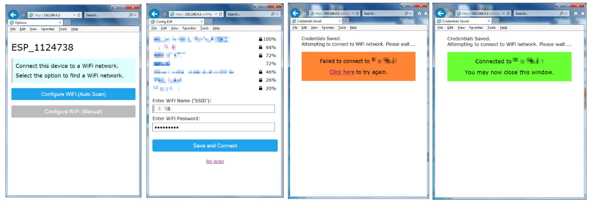

# WiFiConnect (without the OLED functionality)
WiFi Manager for ESP8266 and ESP32 chips

Note: This fork is a copy of https://github.com/smurf0969/WiFiConnect but with the OLED components (.h, .cpp) files REMOVED ironically because smurf's re-implementation of [WiFiManager](https://github.com/tzapu/WiFiManager) is much cleaner and I do not require the need for OLED support, nor does it compile without it.

Enhancements made in this fork can be merged upstream to the benefit of smurf0969's library.

Refer to the original https://github.com/smurf0969/WiFiConnect library for a full package with the OLED bits.

## So what improvements does it have?

* Cleaner Web Interface (the original WiFiManager interface needed a few tweaks)
* Attempts to provide WiFi connection status Success / Fail notification upon user-submission.
* Some other code changes to make it useful.

Essentially if you want a improved version of WiFiManager and don't need OLED support, then use this.

